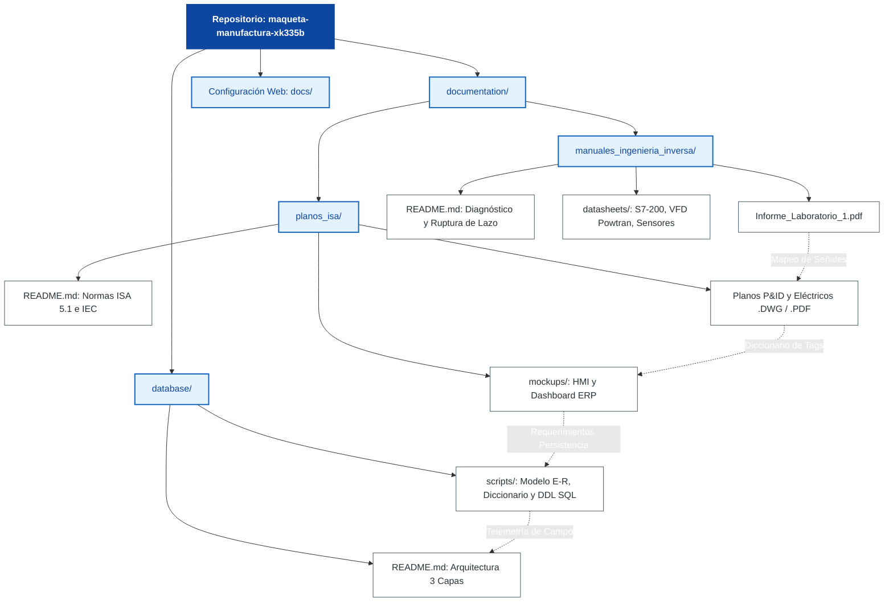

# Maqueta de Proceso de Manufactura Flexible (XK-335B)
### Proyecto Integrado de Control Industrial y Sistemas Computacionales
**Universidad Mayor de San Andrés (UMSA) — Facultad de Ingeniería**  
**Carrera de Ingeniería Electrónica — Gestión II/2026**

---

## 📌 1. Información General del Proyecto
Este repositorio alberga la documentación técnica, diagramas de instrumentación (ANSI/ISA-S5.1), esquemas de potencia y mando (IEC/IEEE), modelado de persistencia de datos (PostgreSQL) y código fuente de control para la **Planta de Manufactura Flexible**. El desarrollo se enmarca en la **Fase 1: Auditoría Kaizen e Ingeniería Inversa** del programa inter-asignaturas concurrente.

* **Docente Auditor:** Ing. Jorge Antonio Nava Amador
* **Auxiliares de Docencia:**
  * Aux. Limber Ajnota Cahuaya (ETN-1034)
  * Aux. Fabian Plata Vargas (ETN-902)
  * Aux. Franz Choque (ETN-1000)

---

## 👥 2. Integrantes del Equipo de Trabajo

| Estudiante | Asignatura | Rol Principal |
| :--- | :---: | :--- |
| **Univ. López Rodríguez Miguel Ángel** | **ETN-1034** | **Auditoría de Hardware y Red RS-485** |
| Univ. Wilson David Huanca Challco | ETN-1034 | Inspección de Procesamiento y Análisis de Ruptura de Lazo |
| Univ. Siñani Canaza Juan Carlos | ETN-1034 | Mapeo I/O de PLCs y Diagnóstico de Actuadores |
| Univ. Henrry Jherson Torrez Patty | ETN-902 | Clasificación de Variables (PV, MV, DV) y Causalidad Dinámica |
| Univ. Gandarillas Conde Valeria Erika | ETN-1000 | Modelado Entidad-Relación y Normalización (3FN) |
| Univ. Quisbert Bautista Paul Fernando | ETN-1000 | Arquitectura de Telemetría (3 Capas) y Diccionario de Datos |
| Univ. Cuevas Perez Mauricio | ETN-1000 | Análisis de Infraestructura Local y Gestión de Scripts SQL |

---

## 🗺️ 3. Mapa de Flujo Documental y Arquitectura del Repositorio

A continuación se presenta la trazabilidad metodológica y el flujo de interconexión técnica entre la documentación, el diseño CAD y el backend de base de datos:



---

## 🏭 4. Descripción Técnica de la Planta (Manufactura Flexible)
La planta modular se compone de 5 estaciones de trabajo automatizadas mediante controladores lógicos programables **Siemens SIMATIC S7-200 CN** interconectados en un bus multipunto serial **RS-485** bajo topología en cascada (*Daisy-Chain*):

1. **Unidad de Alimentación (Feeding Unit):** Controlada por CPU 224 CN. Administra el dispensado por gravedad y eyección neumática de piezas base.
2. **Unidad de Procesamiento (Processing Unit):** Controlada por CPU 224 CN. Ejecuta la simulación de estampado y maquinado mediante cilindros neumáticos y mordaza de sujeción.
3. **Unidad de Ensamblaje (Assembly Unit):** Controlada por CPU 226 CN. Montaje de tapas y pasadores mediante actuador rotativo y pinza neumática.
4. **Unidad de Transporte (Transmission Unit):** Controlada por CPU 226 CN (DC/DC/DC). **Nodo Maestro del bus RS-485**; gestiona la cinemática del manipulador de 3 GDL acoplado a un servomotor Panasonic y transportador lineal.
5. **Unidad de Selección (Sorting Unit):** Controlada por CPU 224XP CN. Clasificación selectiva de materiales (metálicos y no metálicos) sobre cinta transportadora accionada por motor trifásico y VFD POWTRAN PT9100A (consigna analógica 0-10 V).

---

## 📂 5. Estructura del Repositorio
La organización de directorios cumple con la jerarquía estandarizada de ingeniería:

```text
├── database/
│   └── scripts/                  # Scripts DDL/DML, modelos CASE y esquemas E-R normalizados
├── documentation/
│   ├── manuales_ingenieria_inversa/ # Fichas técnicas de sensores, actuadores y reportes de campo
│   └── planos_isa/               # Planos P&ID (ANSI/ISA-S5.1) y esquemas eléctricos (IEC) en DWG/PDF
├── docs/                         # Entorno de visualización y despliegue web
└── README.md                     # Memoria descriptiva principal del proyecto
```

---

## 🛠️ 6. Resumen de Hallazgos y Auditoría Kaizen (Lab 1)
Durante la inspección cable por cable y análisis fenomenológico se identificaron las siguientes discrepancias críticas respecto a los antecedentes históricos:
* **Identificación de Actuador en Selección:** Se rectificó que el accionamiento principal es un motor AC trifásico alimentado por VFD POWTRAN PT9100A (entrada monofásica 220 VAC, salida trifásica), desmintiendo reportes históricos erróneos.
* **Sensores Omitidos:** Incorporación al inventario de los sensores capacitivos Winston CM18 en la unidad de selección.
* **Ruptura de Causalidad y Lazo Abierto:** Demostración analítica de pérdida de observabilidad ($C = [0\ 0]$) y riesgo de colisión o *deadlock* ante fallas en los sensores magnéticos (SMC D-C73) de la prensa de procesado.
* **Seguridad Crítica:** Detección de avería mecánica interna en la parada de emergencia (Tag QS) de la estación de transporte (bloqueada en '1' lógico).

---

## 🔄 7. Flujo de Trabajo y Control de Versiones
* Cada miembro del equipo desarrollará sus modificaciones en ramas específicas (`feature/<nombre-tarea>`).
* Queda estrictamente restringido el *push* directo sobre la rama `main`.
* La integración de código y esquemas se formaliza mediante **Pull Requests (PR)** sujetos a revisión técnica (*Code Review*) por parte del auditor técnico o auxiliares de docencia.